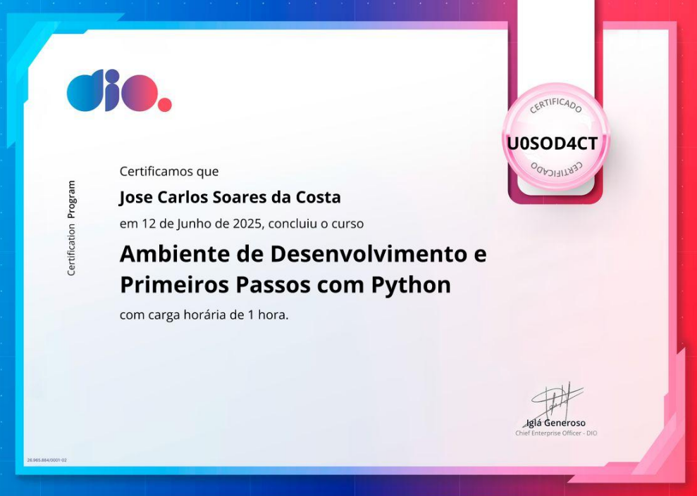
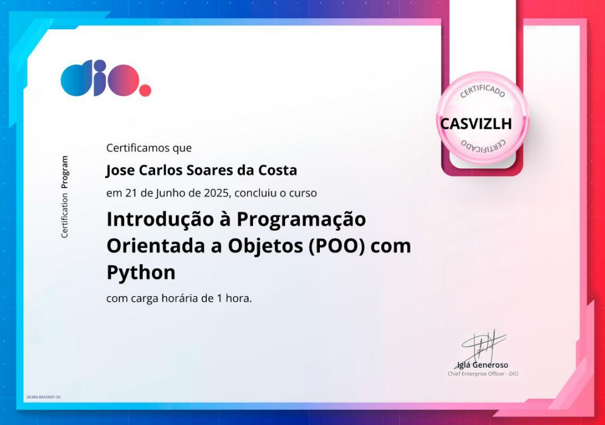
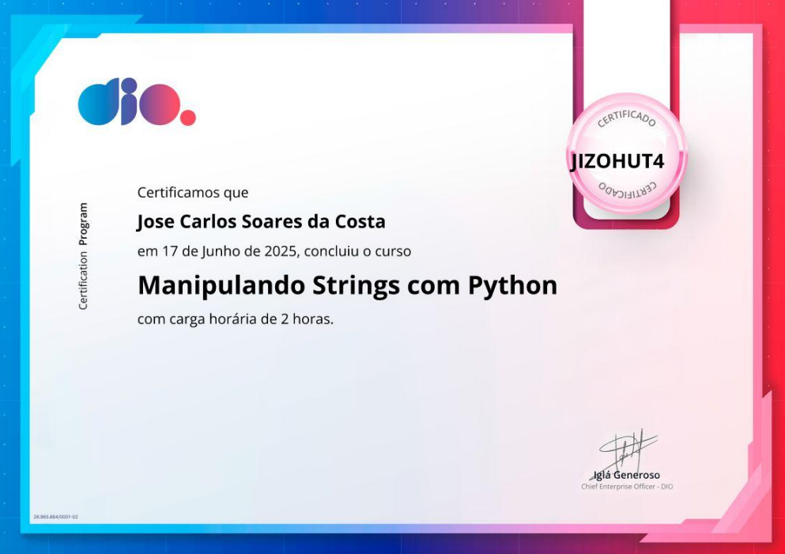

# 📜 Meus Certificados em Tecnologia

Este repositório reúne meus principais certificados em tecnologia, conquistados ao longo da minha jornada de transição de carreira. Eles representam minha dedicação constante ao aprendizado e à prática de habilidades essenciais para o desenvolvimento de software, com **ênfase em Python** e também abrangendo outras linguagens e áreas fundamentais.

## 🧠 Principais Competências

### 🐍 Python (Foco principal)
- Manipulação de dados com `pandas`, `numpy`
- APIs com `Flask` e `Bottle`
- Orientação a Objetos, Padrões de Projeto (SOLID, Strategy, Command etc.)
- Testes com `unittest`
- Web scraping com `requests`, `BeautifulSoup`, `Selenium`
- Automatizações e integração com GitHub API
- Tipagem estática (`mypy`) e boas práticas
- Análise de dados
- Visualização de dados

> ✅ Veja os projetos práticos com Python no meu portfólio:  
> 🔗 [portfolio-carlos-costa.netlify.app](https://portfolio-carlos-costa.netlify.app/)

---

### 🗄️Machine Learning - Aprendizado de Máquina
- Arquitetura e Estrutura dos LLMs
- Fundamentos do LLM
- Introdução ao Machine Learning
- ...

### 🗄️ SQL
- Modelagem de dados e normalização
- Comandos DDL, DML, DQL
- Consultas avançadas (JOIN, GROUP BY, HAVING, SUBQUERIES)
- Uso com `SQLite`, `MySQL`, `MariaDB`, e integração com Python

### 🔧 Git & GitHub
- Versionamento de código
- Branching, Merge, Pull Requests
- Fluxo GitHub Flow e GitHub Actions (CI/CD)

### 🌐 HTML & CSS
- Criação de páginas responsivas com `Flexbox` e `Grid`
- Uso de `Bootstrap`
- Noções de acessibilidade e SEO básico

### ☕ Java & Spring Boot
- Fundamentos da linguagem Java
- Programação orientada a objetos
- Criação de APIs REST com Spring Boot

### 💻 Linux
- Comandos básicos e intermediários no terminal
- Gerenciamento de pacotes (apt, yum)
- Permissões, processos e automação com shell script

### 📜 PHP
- Estruturas de controle e manipulação de formulários
- Integração com banco de dados
- Desenvolvimento web básico

### ⚡ JavaScript
- Manipulação de DOM
- Eventos e interatividade
- Consumo de APIs via `fetch`

---

## 🗂️ Lista de Certificados

| Tecnologia | Categoria | Status |
|------------|---------------------|--------|
| Python     |
|  |          | ✅ Concluído |
| Python     | APIs com Flask - Curso próprio         | ✅ Concluído |
| LLM        | Modelo de Linguagem de Grande Escala   | ✅ Concluído |
| SQL        | SQL Completo - Curso em Vídeo / Alura  | ✅ Concluído |
| Git & GitHub | Git/GitHub Profissional - Udemy      | ✅ Concluído |
| HTML/CSS   | HTML5 & CSS3 - Curso em Vídeo          | ✅ Concluído |
| Java       | Fundamentos de Java - DIO / Alura      | ✅ Concluído |
| JavaScript | JS Essencial - Curso em Vídeo / Udemy  | ✅ Concluído |
| Linux      | Linux Fundamentals - LinuxTips         | ✅ Concluído |
| PHP        | PHP para Iniciantes - Curso em Vídeo   | ✅ Concluído |
| Spring Boot| APIs REST com Spring Boot - Udemy      | ✅ Concluído |
| Outros     | Miscelânea - DIO                       | ✅ Concluído |

---

<table>
    <caption> Python</caption>
  <tr>
    <td> </td>
    <td></td>
    <td></td>
    <td></td>
    <td></td>
  </tr>
  <tr>
    <td></td>
    <td></td>
    <td></td>
    <td></td>
    <td></td>
  </tr> 
  <tr>
    <td></td>
    <td></td>
    <td></td>
    <td></td>
    <td></td>
  </tr> 
  <tr>
    <td></td>
    <td></td>
    <td></td>
    <td></td>
    <td></td>
  </tr> 
  
</table>
<table>
    <caption> Python - Data Science</caption>
  <tr>
    <td> </td>
    <td></td>
    <td></td>
    <td></td>
    <td></td>
  </tr>
</table>

---

## 📂 Organização dos Arquivos

certificados/ 
├── python/ 
│ └── 22-certificados 
├── Machine Learning 
| └── 17 certificados 
├── Análise de Dados 
| └── 2 certificados 
├── sql/ 
│ └── 2-certificados 
├── git-github/ 
│ └── 3-certificados 
├── html-css/ 
│ └── 5-certificados 
├── java/ 
│ └── 12-certificados 
├── javascript/ 
│ └── 8-certificados 
├── linux/ 
│ └── 1-certificado 
├── php/ 
│ └── 8-certificados 
├── spring-boot/ 
│ └── 4-certificados 
├── Outros 
│ └── 11-certificados 

---

## 👨‍💼 Sobre Mim

**José Carlos Soare da Costa**  
Recife, PE - Brasil  
Telefone: +55 81 99712 9140 
Email: [jcarlossc1977@gmail.com](mailto:jcarlossc1977@gmail.com)  
LinkedIn: [linkedin.com/in/carlos-da-costa-669252149](https://www.linkedin.com/in/carlos-da-costa-669252149/)  
GitHub: [github.com/jcarlossc](https://github.com/jcarlossc)  
Kaggle: [kaggle.com/jcarlossc](https://www.kaggle.com/jcarlossc/code)

---

## 🚀 Portfólio

Veja meus projetos práticos e aplicações reais em:

👉 **[portfolio-carlos-costa.netlify.app](https://portfolio-carlos-costa.netlify.app/)**

---

## 💬 Licença

Este repositório é apenas demonstrativo, com intuito de compartilhar minha formação contínua. Os certificados são pessoais e intransferíveis.

