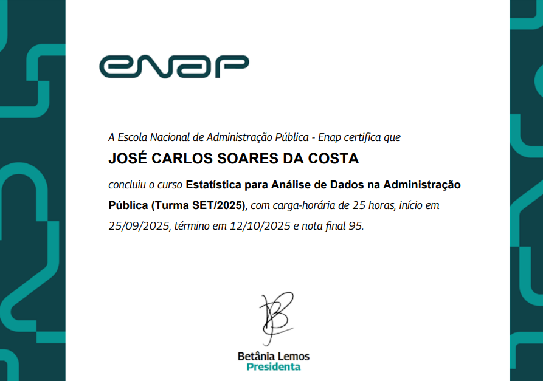
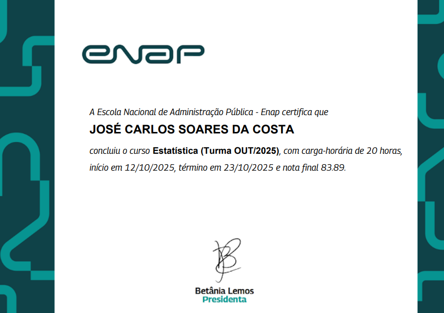
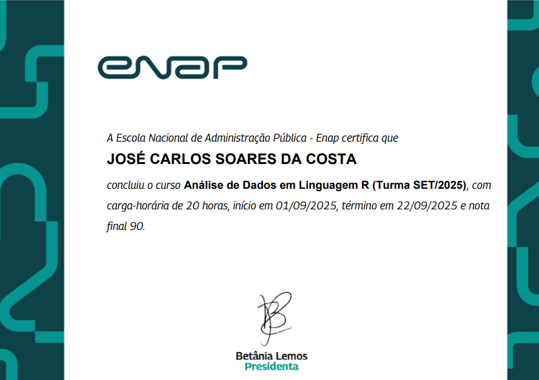
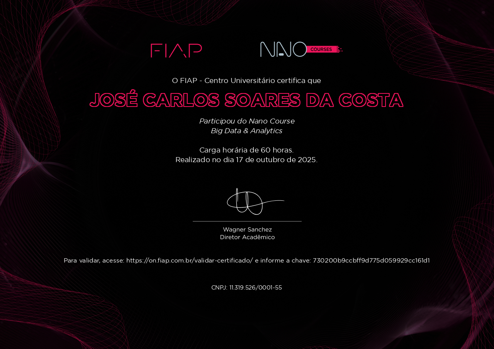
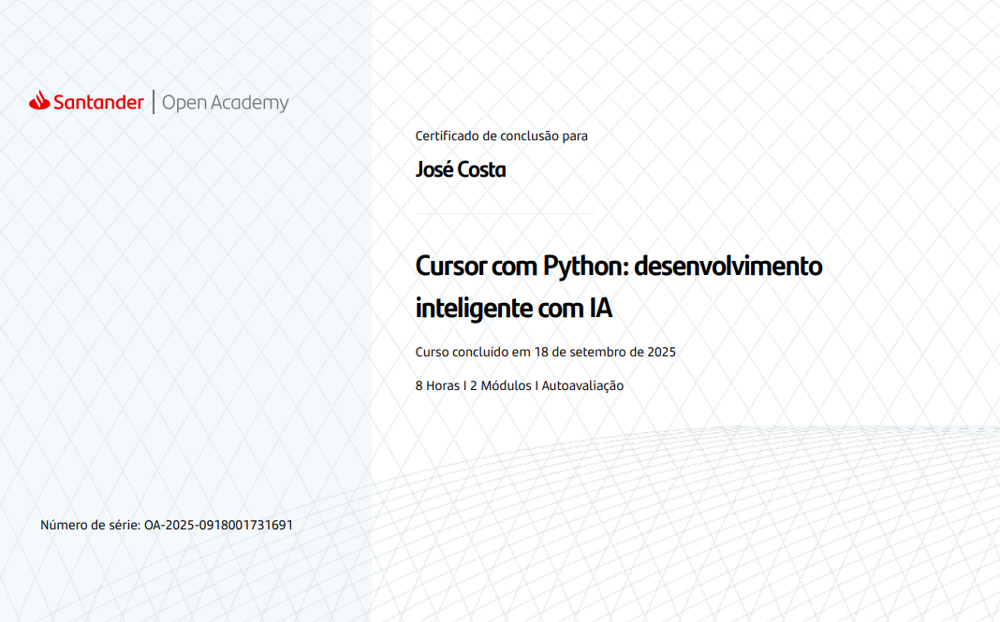
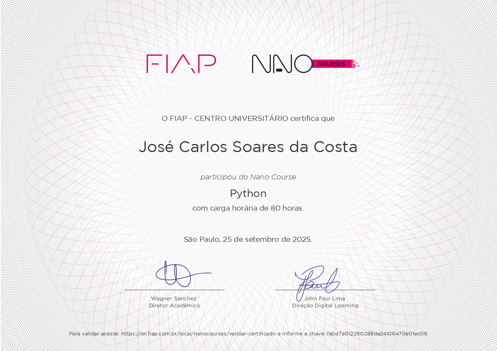
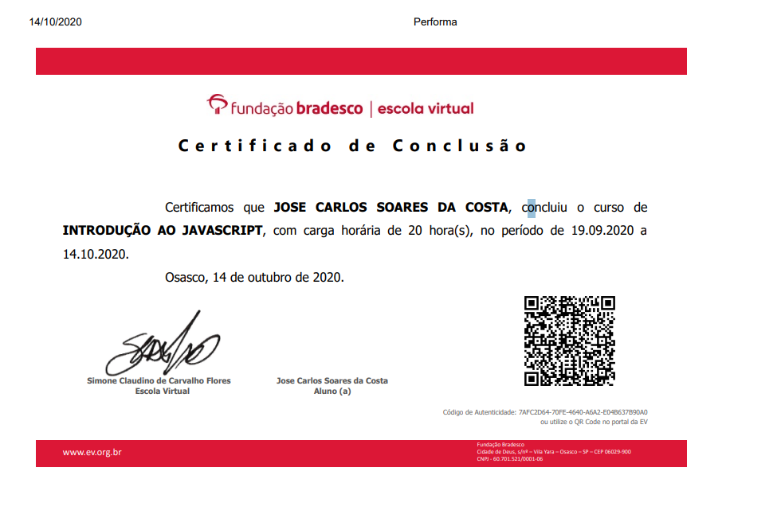
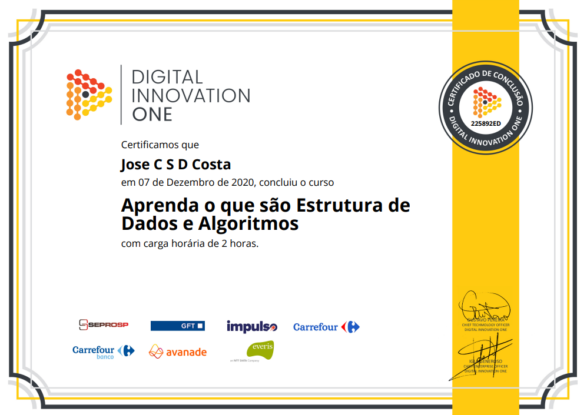

# 📌 Meus Certificados em Tecnologia

Este repositório reúne meus principais certificados em tecnologia, conquistados ao longo da minha jornada de transição de carreira. Eles representam minha dedicação constante ao aprendizado e à prática de habilidades essenciais para o desenvolvimento de software, com **ênfase em Python** e também abrangendo outras linguagens e áreas fundamentais.

## 📌 Principais Competências

### 📌 Python (Foco principal)
- Manipulação de dados com `pandas`, `numpy`
- APIs com `Flask` e `Bottle`
- Orientação a Objetos, Padrões de Projeto (SOLID, Strategy, Command etc.)
- Testes com `unittest`
- Web scraping com `requests`, `BeautifulSoup`, `Selenium`
- Automatizações e integração com GitHub API
- Tipagem estática (`mypy`) e boas práticas
- Análise de dados
- Visualização de dados

> 📌 Veja os projetos práticos com Python no meu portfólio:  
> 🔗 [portfolio-carlos-costa.netlify.app](https://portfolio-carlos-costa.netlify.app/)

---

## 📌 Lista de Certificados
<table>
    <caption> Graduação: Análise e Desenvolvimento de Sistemas</caption>
  <tr>
     <td></td>
  </tr>
</table>

<table>
    <caption> Estatística</caption>
  <tr>
    <td> </td>
    <td> </td>
    <td> </td>
    <td> </td>
  </tr>
</table>

<table>
    <caption> R</caption>
  <tr>
    <td> </td>
    <td> </td>
  </tr>   
</table>

<table>
    <caption> Python - Data Science</caption>
  <tr>
    <td></td>
    <td></td>
    <td></td>
    <td></td>
    <td> </td>
  </tr>
    <tr>
    <td></td>
    <td></td>
  </tr>
</table>

<table>
    <caption> Python</caption>
  <tr>
    <td> </td>
    <td></td>
    <td></td>
    <td></td>
    <td></td>
  </tr>
  <tr>
    <td></td>
    <td></td>
    <td></td>
    <td></td>
    <td></td>
  </tr> 
  <tr>
    <td></td>
    <td></td>
    <td></td>
    <td></td>
    <td></td>
  </tr> 
  <tr>
    <td></td>
    <td></td>
    <td></td>
    <td></td>
    <td></td>
  </tr> 
  <tr>
    <td></td>
    <td> </td>
    <td> </td>
    <td> </td>
    <td> </td>
  </tr> 
  <tr>
    <td> </td>
    <td> </td>
    <td></td>
    <td></td>
    <td></td>   
  </tr> 
  <tr>
    <td></td>
    <td></td>  
    <td></td>  
  </tr> 
</table>

<table>
    <caption> Machine Learning - Python/R/Scilab/Anaconda/Colab/Jupyter</caption>
  <tr>
    <td> </td>
    <td> </td>
    <td> </td>
    <td> </td>
    <td> </td>
  </tr>
  <tr>
    <td> </td>
    <td> </td>
    <td> </td>
    <td> </td>
    <td> </td>
  </tr>
  <tr>
    <td> </td>
    <td> </td>
    <td> </td>
    <td> </td>
    <td> </td>
  </tr>
  <tr>
    <td> </td>
    <td> </td>
    <td> </td>
    <td> </td>
    <td> </td>
  </tr>
  <tr>
    <td> </td>
    <td> </td>
    <td> </td>
    <td> </td>
  </tr>
</table>

<table>
    <caption> Banco de Dados</caption>
  <tr>
    <td> </td>
    <td></td>
    <td></td>
    <td></td>
    <td></td>
  </tr>
</table>

<table>
    <caption> Git/Github</caption>
  <tr>
    <td> </td>
    <td> </td>
    <td> </td>
    <td> </td>
    <td> </td>
  </tr>
  <tr>
    <td> </td>
  </tr>
</table>

<table>
    <caption> Html/Css/Bootstrap</caption>
  <tr>
    <td> </td>
    <td> </td>
    <td> </td>
    <td> </td>
    <td> </td>
  </tr>
</table>

<table>
    <caption> Javascript</caption>
  <tr>
    <td> </td>
    <td> </td>
    <td> </td>
    <td> </td>
    <td> </td>
  </tr>
  <tr>
    <td> </td>
    <td> </td>
    <td> </td>
    <td> </td>
  </tr>    
</table>
<table>
    <caption> Linux</caption>
  <tr>
    <td> </td>
  </tr>  
</table>
<table>
    <caption> Miscelânea</caption>
  <tr>
    <td> </td>
    <td> </td>
    <td> </td>
    <td> </td>
    <td> </td>
  </tr>  
  <tr>
    <td> </td>
    <td> </td>
    <td> </td>
    <td> </td>
    <td> </td>
  </tr>   
</table>

<table>
    <caption> Java</caption>
  <tr>
    <td> </td>
    <td> </td>
    <td> </td>
    <td> </td>
    <td> </td>
  </tr>   
  <tr>
    <td> </td>
    <td> </td>
    <td> </td>
    <td> </td>
    <td> </td>
  </tr>   
  <tr>
    <td> </td>
    <td> </td>
  </tr>   
</table>

<table>
    <caption> Spring Boot</caption>
  <tr>
    <td> </td>
    <td> </td>
    <td> </td>
    <td> </td>
  </tr>    
</table>

<table>
    <caption> Php</caption>
  <tr>
    <td> </td>
    <td> </td>
    <td> </td>
    <td> </td>
    <td> </td>
  </tr>    
  <tr>
    <td> </td>
    <td> </td>
    <td> </td>
  </tr>    
</table>

---

## 📌 Contatos

**José Carlos Soare da Costa**  
📌Recife, PE - Brasil 
📌Telefone: +55 81 99712 9140 
📌Telegram: @jcarlossc 
📌Blogger linguagem R: [https://informaticus77-r.blogspot.com/](https://informaticus77-r.blogspot.com/) 
📌Blogger linguagem Python: [https://informaticus77-python.blogspot.com/](https://informaticus77-python.blogspot.com/) 
📌Email: jcarlossc1977@gmail.com 
📌Portfólio em construção: https://portfolio-carlos-costa.netlify.app/ 
📌LinkedIn: https://www.linkedin.com/in/carlos-da-costa-669252149/ 
📌GitHub: https://github.com/jcarlossc 
📌Kaggle: https://www.kaggle.com/jcarlossc/  
📌Twitter/X: https://x.com/jcarlossc1977

---

## 📌 Portfólio

Veja meus projetos práticos e aplicações reais em:

📌 **[portfolio-carlos-costa.netlify.app](https://portfolio-carlos-costa.netlify.app/)**

---

## 📌 Licença

Este repositório é apenas demonstrativo, com intuito de compartilhar minha formação contínua. Os certificados são pessoais e intransferíveis.

